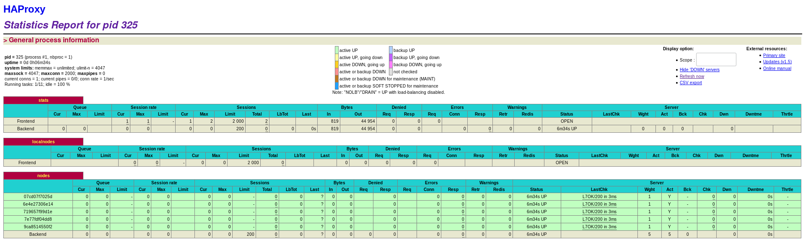
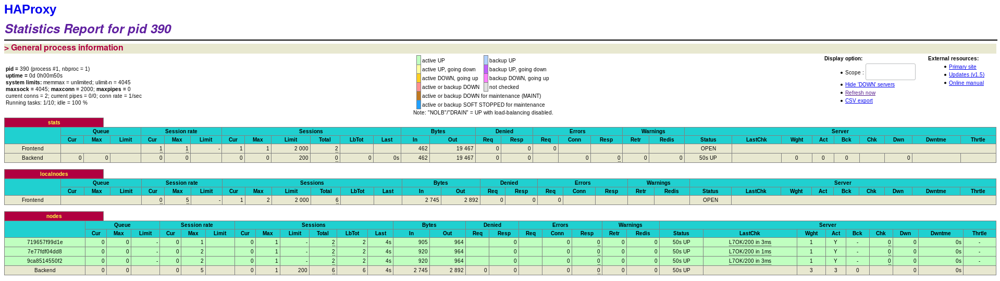
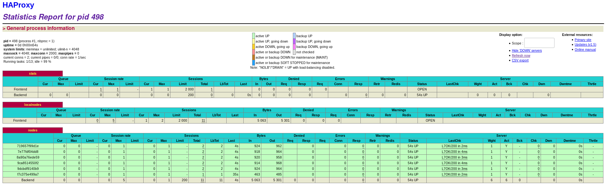

## Lab 04 - Docker
---

Authors: Tano Iannetta, Loan Lassalle

You will find this lab [on GitHub](https://github.com/SoftEng-HEIGVD/Teaching-HEIGVD-AIT-2016-Labo-Docker)  

### Table of contents

1. [Introduction](#introduction)  
  1.1 [Pedagogical objectives](#pedagogical-objectives)  
  1.2 [Instructions for the lab report](#instructions-lab)
2. [Identify issues and install the tools](#task-0)  
  2.1 [Identify issues](#identify-issues)  
  2.2 [Install the tools](#install-tools)
3. [Add a process supervisor to run several processes](#task-1)
4. [Add a tool to manage membership in the web server cluster](#task-2)
5. [React to membership changes](#task-3)
6. [Use a template engine to easily generate configuration files](#task-4)
7. [Generate a new load balancer configuration when membership changes](#task-5)
6. [Make the load balancer automatically reload the new configuration](#task-6)
8. [Difficulties](#difficulties)
9. [Sources](#sources)

### <a name="introduction"></a>Introduction

#### <a name="pedagogical-objectives"></a>Pedagogical objectives

* Build your own Docker images

* Become familiar with lightweight process supervision for Docker

* Understand core concepts for dynamic scaling of an application in production

* Put into practice decentralized management of web server instances

#### <a name="instructions-lab"></a>Instructions for the lab report

This lab builds on a previous lab on load balancing.

In this lab you will perform a number of tasks and document your progress in a lab report. Each task specifies one or more deliverables to be produced.
Collect all the deliverables in your lab report. Give the lab report a structure that mimics the structure of this document.

We expect you to have in your repository (you will get the instructions later for that) a folder called `report` and a folder called `logs`. Ideally, your report should be in Markdown format directly in the repository.

The lab consists of 6 tasks and one initial task (the initial task should be quick if you already completed the lab on load balancing):

### <a name="task-0"></a>Task 0: Identify issues and install the tools

#### <a name="identify-issues"></a>Identify issues

1. <a name="M1"></a>**[M1]** Do you think we can use the current solution for a production environment? What are the main problems when deploying it in a production environment?

   We think we can't use the current solution for production environment. If we decide to add a server to the infrastructure, we need to do a lot of work. We must to edit the configuration file of HAProxy and declare each server manually. It's a lot of work to set up and maintain.

2. <a name="M2"></a>**[M2]** Describe what you need to do to add new
   `webapp` container to the infrastructure. Give the exact steps of
   what you have to do without modifiying the way the things are
   done. Hint: You probably have to modify some configuration and
   script files in a Docker image.

   We need to change ha/config/haproxy.cfg file
   and add a new line :
   ```bash
      server s3 <s3>:3000 check
   ```
   Same thing in the ha/scripts/run.sh file:
   ```bash
   sed -i 's/<s3>/$S3_PORT_3000_TCP_ADDR/g' /usr/local/etc/haproxy/haproxy.cfg
   ```
   Since we modify the config of ha container, we need to re-build it. When
   it's done, we can normally run the ha container and don't forget to run also
   the new server s3.

3. <a name="M3"></a>**[M3]** Based on your previous answers, you have
   detected some issues in the current solution. Now propose a better
   approach at a high level.

   The configuration should not be static but dynamic.
   We should use a tool or a program to communicate with te load balancer to tell
   it which servers are up or down. Thanks to this, the configuration (when a new
   node is created or when one is down) will be done automatically and it would be
   less painful for the system administrator.

4. <a name="M4"></a>**[M4]** You probably noticed that the list of web
  application nodes is hardcoded in the load balancer
  configuration. How can we manage the web app nodes in a more dynamic
  fashion?

  As said previously, we should user a special tool that
  will say to the load balancer all servers that are connected. For this lab, we
  will be introduced to the serf agent. Basically, its job is to notify the load
  balancer when a node is up or down.

5. <a name="M5"></a>**[M5]** In the physical or virtual machines of a
   typical infrastructure we tend to have not only one main process
   (like the web server or the load balancer) running, but a few
   additional processes on the side to perform management tasks.

   For example to monitor the distributed system as a whole it is
   common to collect in one centralized place all the logs produced by
   the different machines. Therefore we need a process running on each
   machine that will forward the logs to the central place. (We could
   also imagine a central tool that reaches out to each machine to
   gather the logs. That's a push vs. pull problem.) It is quite
   common to see a push mechanism used for this kind of task.

   Do you think our current solution is able to run additional
   management processes beside the main web server / load balancer
   process in a container? If no, what is missing / required to reach
   the goal? If yes, how to proceed to run for example a log
   forwarding process?

   For now, only one process can run. We have to work around this problem to log the nodes. This solution would help to maintain correctly our application and keep a trace automatically.

6. <a name="M6"></a>**[M6]** In our current solution, although the
   load balancer configuration is changing dynamically, it doesn't
   follow dynamically the configuration of our distributed system when
   web servers are added or removed. If we take a closer look at the
   `run.sh` script, we see two calls to `sed` which will replace two
   lines in the `haproxy.cfg` configuration file just before we start
   `haproxy`. You clearly see that the configuration file has two
   lines and the script will replace these two lines.

   What happens if we add more web server nodes? Do you think it is
   really dynamic? It's far away from being a dynamic
   configuration. Can you propose a solution to solve this?

   No, it's not, because we need to change two files to add more nodes
   (see answer 2). A better solution would be that each server announces
   itself to the other and the load balancer when it's up.

#### <a name="install-tools"></a>Install the tools

All tools were installed and configured in the previous lab.

```bash
vagrant@ubuntu-14:~$ docker ps
CONTAINER ID        IMAGE                  COMMAND                  CREATED             STATUS              PORTS                                                                NAMES
ca41d450c676        softengheigvd/ha       "/docker-entrypoint.…"   24 seconds ago      Up 23 seconds       0.0.0.0:80->80/tcp, 0.0.0.0:1936->1936/tcp, 0.0.0.0:9999->9999/tcp   ha
c160fa8469fa        softengheigvd/webapp   "/scripts/run.sh"        24 seconds ago      Up 23 seconds       3000/tcp                                                             s2
78a6d9e876a0        softengheigvd/webapp   "/scripts/run.sh"        25 seconds ago      Up 24 seconds       3000/tcp                                                             s1
```

**Deliverables**:

1. Take a screenshot of the stats page of HAProxy at http://192.168.42.42:1936. You should see your backend nodes.


2. Give the URL of your repository URL in the lab report.

[URL of our repository](https://github.com/galahad1/Teaching-HEIGVD-AIT-2016-Labo-Docker)

### <a name="task-1"></a>Task 1: Add a process supervisor to run several processes

> In this task, we will learn to install a process supervisor that will help us to solve the issue presented in the question [M5](#M5). Installing a process supervisor gives us the ability to run multiple processes at the same time in a Docker environment.

**Deliverables**:

1. Take a screenshot of the stats page of HAProxy at http://192.168.42.42:1936. You should see your backend nodes. It should be really similar to the screenshot of the previous task.


2. Describe your difficulties for this task and your understanding of what is happening during this task. Explain in your own words why are we installing a process supervisor. Do not hesitate to do more research and to find more articles on that topic to illustrate the problem.

The s6-overlay has a folder at /etc/services.d to create service directories at. Each service should be a directory, and each directory should have a run script.
Each service is started with a completely blank environment, and it’s up to you to setup the environment variables. When the container starts up, all the environment variables are saved to /var/run/s6/container_environment/. The s6-overlay has a script to re-import all of those environment variables – with-contenv. It loads the environment variables, then chainloads into another program.

A container’s main running process is the ENTRYPOINT and/or CMD instruction at the end of the Dockerfile. It is generally recommended that you separate areas of concern by using one service per container. That service may fork into multiple processes (for example, Apache web server starts multiple worker processes). It therefore is easy to have multiple processes.
We are installing a process supervisor to have the possibility to run one or more processes at a time in a Docker container. It will give us the possibility to manage different application's processes. With a supervisor, we will be able to run a server and a process to log it.

We did not have difficulties because there are pretty good tutorials over the Internet to explain everything.

### <a name="task-2"></a>Task 2: Add a tool to manage membership in the web server clusterdifferentdifferent

> In this task, we will focus on how to make our infrastructure more flexible so that we can dynamically add and remove web servers. To achieve this goal, we will use a tool that allows each node to know which other nodes exist at any given time.

**Deliverables**:

1. Provide the docker log output for each of the containers: `ha`,
   `s1` and `s2`. You need to create a folder `logs` in your
   repository to store the files separately from the lab
   report. For each lab task create a folder and name it using the
   task number. No need to create a folder when there are no logs.

   The logs are available under the logs folder, hierarchised as follow:

   ```
   |-- root folder
     |-- logs
       |-- task_2
       |-- task_3
       |-- task_4
       |-- task_5
   ```

2. Give the answer to the question about the existing problem with the
   current solution.

   The problem with the current solution is that a node must join an already existing node.
   If he does not join another node, he will create his own cluster. If HAProxy is executed first, the child nodes will not be linked to it.
   That's why we need to run HAProxy first.

3. Give an explanation on how `Serf` is working. Read the official
   website to get more details about the `GOSSIP` protocol used in
   `Serf`. Try to find other solutions that can be used to solve
   similar situations where we need some auto-discovery mechanism.

   Serf is a tool for cluster membership, failure detection and decentralized orchestration; it is fault-tolerant and highly available.
   Each nodes execute a serf agent that talk to each other using a decentralized peer-to-peer protocol to exchange information. They form a cluster of nodes. Serf uses a gossip protocol to broadcast messages to the cluster. The main information they exchange is the existence of nodes in the cluster and what their IP addresses are. When a node appears or disappears the Serf agents tell each other about the event. When the information arrives at the load balancer we will be able to react accordingly. A Serf agents can trigger the execution of local scripts when it receives an event.

   Serf uses a gossip channel. A gossip protocol is a procedure or process of computer-computer communication that is based on the way social networks disseminate information or how epidemics spread. It informs all others nodes in the cluster each time a node enters or leaves. Those channels use UDP protocol.

### <a name="task-3"></a>Task 3: React to membership changes

> We reached a state where we have nearly all the pieces in place to make the infrastructure really dynamic. At the moment, we are missing the scripts that will react to the events reported by `Serf`, namely member `leave` or member `join`.

> We will start by creating the scripts in [ha/scripts](ha/scripts). So create two files in this directory and set them as executable.

**Deliverables**:

1. Provide the docker log output for each of the containers:  `ha`, `s1` and `s2`.
   Put your logs in the `logs` directory you created in the previous task.

   You can find the docker log output for each containers in the `/logs/task_3/` folder.


2. Provide the logs from the `ha` container gathered directly from the `/var/log/serf.log` file present in the container. Put the logs in the `logs` directory in your repo.

  You can find the log from the `ha` container gathered directly from the `/var/log/serf.log` file present in the container at `/logs/task_3/serf_logs`


### <a name="task-4"></a>Task 4: Use a template engine to easily generate configuration files

> There are several ways to generate a configuration file from variables in a dynamic fashion. In this lab we decided to use `NodeJS` and `Handlebars` for the template engine. In our case our template is the `HAProxy` configuration file in which we put placeholders written in the template language. Our data model is the data provided by the handler scripts of `Serf`. And the resulting document coming out of the template engine is a configuration file that HA proxy can understand where the placeholders have been replaced with the data.

**Deliverables**:

1. You probably noticed when we added `xz-utils`, we have to rebuild
   the whole image which took some time. What can we do to mitigate
   that? Take a look at the Docker documentation on
   [image layers](https://docs.docker.com/engine/userguide/storagedriver/imagesandcontainers/#images-and-layers).
   Tell us about the pros and cons to merge as much as possible of the
   command. In other words, compare:

  ```
  RUN command 1
  RUN command 2
  RUN command 3
  ```

  vs.

  ```
  RUN command 1 && command 2 && command 3
  ```

  There are also some articles about techniques to reduce the image
  size. Try to find them. They are talking about `squashing` or
  `flattening` images.

  A Docker image is built up from layers. Each layer is an instruction in the Dockerfile. It is a better practice to have a minimal number of layers in an image, because the size can become important really quickly. That's why putting all commands in one RUN instruction is a better practice; it will reduce the size of the image. On the other hand, each layer is cached, so when an image is re-built, it could be faster to not re-download all the packages. So in our case, the first solution is better.
  An other problem with a merge of commands, like presented here, is that it quickly becomes not trivial to read the Dockerfile when there are a lot of instructions.  
  Regarding the apt-get update and apt-get install, there are a lot of articles, saying that they should be put in one RUN command, because of a cache reason. A single apt-get update will be cached, as said previously, and not re-run every time you need to install something. So it might download an old version of the package.

  Squash or flatten mean that multiples layers of an image will become one single layer. The result of this is to reduce the size of an image. It is a very powerful technique, howerver, it should not be used for every image. You will probably sacrify some functionnality in the process, so it's important to think about it twice. But, let say, if we use someonelse's image and it's too heavy and we want to optimize its size, it is a good tool to use.

2. Propose a different approach to architecture our images to be able
   to reuse as much as possible what we have done. Your proposition
   should also try to avoid as much as possible repetitions between
   your images.

   First, we have to do what is explained in the previous question. Making
   all instructions in one commands. It will reduce the number of layers. Then,   
   we could optimize the size of the image removing all the packages we installed
   and that we no longer need (wget curl vim rsyslog, ...) or use an option such as
   --no-install-recommends.  
   Since we know that Docker caches each layers and reuses them when it is needed, we
   could separated the instruction that will be-reused in other Dockerfiles. Like this,
   when Docker builds an image and had already cached one of the layers, it will simply
   reuse it.

3. Provide the `/tmp/haproxy.cfg` file generated in the `ha` container
   after each step.  Place the output into the `logs` folder like you
   already did for the Docker logs in the previous tasks. Three files
   are expected.

   You can find the config file when only the ha container is started at `/logs/task_4/configFileHa`

   You can find the config file when ha and s1 containers are started at `/logs/task_4/configFileS1`

    You can find the config file when ha, s1 and s2 containers are started at `/logs/task_4/configFileS2`


   In addition, provide a log file containing the output of the
   `docker ps` console and another file (per container) with
   `docker inspect <container>`. Four files are expected.


   You can find the `docker ps` log file at `/logs/task_4/dockerPs`

   You can find the `docker inspect ha` log file at `/logs/task_4/inspectHa`

   You can find the `docker inspect s1` log file at `/logs/task_4/inspectS1`

   You can find the `docker inspect s2` log file at `/logs/task_4/inspectS2`


4. Based on the three output files you have collected, what can you
   say about the way we generate it? What is the problem if any?

### <a name="task-5"></a>Task 5: Generate a new load balancer configuration when membership changes

> At this stage, we have:

  - Two images with `S6` process supervisor that starts a Serf agent and an "application" (HAProxy or Node web app).

  - The `ha` image contains the required stuff to react to `Serf` events when a container joins or leaves the `Serf` cluster.

  - A template engine in the `ha` image is ready to be used to generate the HAProxy configuration file.

> Now, we need to refine our `join` and `leave` scripts to generate a proper HAProxy configuration file.

**Deliverables**:

1. Provide the file `/usr/local/etc/haproxy/haproxy.cfg` generated in
   the `ha` container after each step. Three files are expected.

   You can find the config file when only the ha container is started at `/logs/task_5/step_1/haOnly`

   You can find the config file when ha and s1 containers are started at `/logs/task_5/step_1/s1`

   You can find the config file when ha, s1 and s2 containers are started at `/logs/task_5/step_1/s2`

   In addition, provide a log file containing the output of the
   `docker ps` console and another file (per container) with
   `docker inspect <container>`. Four files are expected.

   You can find the `docker ps` log file at `/logs/task_5/step_1/docker_ps`

   You can find the `docker inspect ha` log file at `/logs/task_5/step_1/inspectHa`

   You can find the `docker inspect s1` log file at `/logs/task_5/step_1/inspectS1`

   You can find the `docker inspect s2` log file at `/logs/task_5/step_1/inspectS2`


2. Provide the list of files from the `/nodes` folder inside the `ha` container. One file expected with the command output.

   You can find the list of nodes present at `logs/task_5/step_2/nodes`


3. Provide the configuration file after you stopped one container and
   the list of nodes present in the `/nodes` folder. One file expected
   with the command output. Two files are expected.

   You can find the config file at `/logs/task_5/step_3/configFile`

   You can find the list of nodes present at `logs/task_5/step_3/nodes`

    In addition, provide a log file containing the output of the
   `docker ps` console. One file expected.

   You can find the `docker ps` log file at `/logs/task_5/step_3/docker_ps`


4. (Optional:) Propose a different approach to manage the list of backend nodes. You do not need to implement it. You can also propose your own tools or the ones you discovered online. In that case, do not forget to cite your references.

### <a name="task-6"></a>Task 6: Make the load balancer automatically reload the new configuration

> The only thing missing now is to make sure the configuration of HAProxy is up-to-date and taken into account by HAProxy.

> We will try to make HAProxy reload his config with minimal downtime. At the moment, we will replace the line `TODO: [CFG] Replace this command` in [ha/services/ha/run](ha/services/ha/run) by the following script part. As usual, take the time to read the comments.

**Deliverables**:

1. Take a screenshots of the HAProxy stat page showing more than 2 web
   applications running. Additional screenshots are welcome to see a
   sequence of experimentations like shutting down a node and starting
   more nodes.

   On the screen below you can the HAProxy stat page with five web application running.
   

   On the screen below we stopped a few web application.
   

   On this screen we restarted some other web applications.
   


   Also provide the output of `docker ps` in a log file. At least
   one file is expected. You can provide one output per step of your
   experimentation according to your screenshots.

   You can find the `docker ps` log file with the five web application running at `/logs/task_6/step_1/1_multiple_nodes/docker_ps`


   You can find the `docker ps` log file when we stopped a few applications at `/logs/task_6/step_1/2_down_some_nodes/docker_ps`

   You can find the `docker ps` log file after we started again some other applications at `/logs/task_6/step_1/3_up_again/docker_ps`


2. Give your own feelings about the final solution. Propose
   improvements or ways to do the things differently. If any, provide
   references to your readings for the improvements.

   It is a good solution because it can manage itself. Cluster creation is automated and information circulates within the network.
   We can improve automatism to check when a node is down and create a new one. It would be enough to monitor logs to detect when a node is missing in the cluster.

3. (Optional:) Present a live demo where you add and remove a backend container.

### <a name="difficulties"></a>Difficulties

One of our difficulties was finding all the information we needed to understand the lab. Sometimes we needed to find information on the web, but it was accurate enough to enlighten us. We found that the instructions were not very clear sometimes.
But after all, we managed to get by.

### <a name="conclusion"></a>Conclusion

In this lab, we learned how to use the HAProxy and how to configure a cluster of nodes. It was interesting, especially about Docker and load balancing. We think that is possible to improve the infrastructure by adding more automation.
The lab was quite long to complete but in the end we learned a lot of useful things for our future work.

### <a name="sources"></a>Sources
